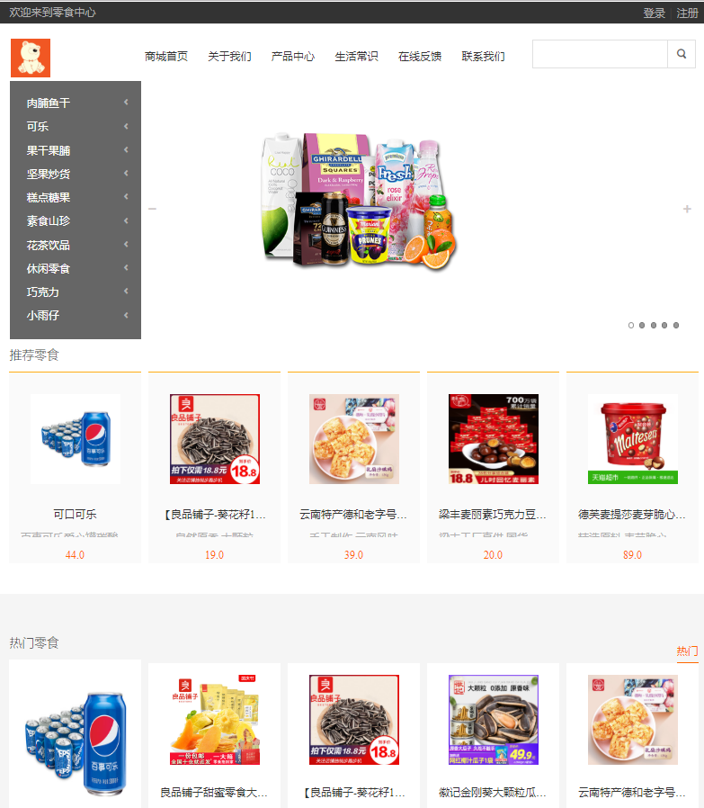
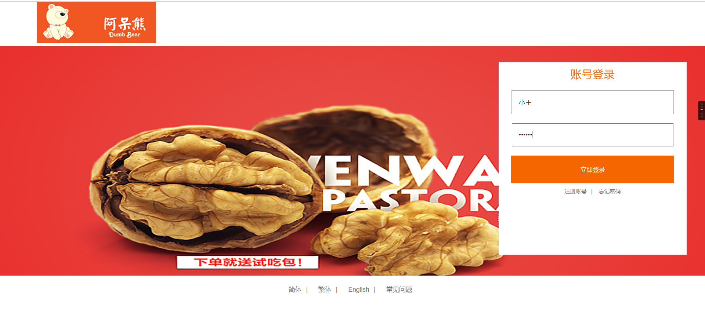
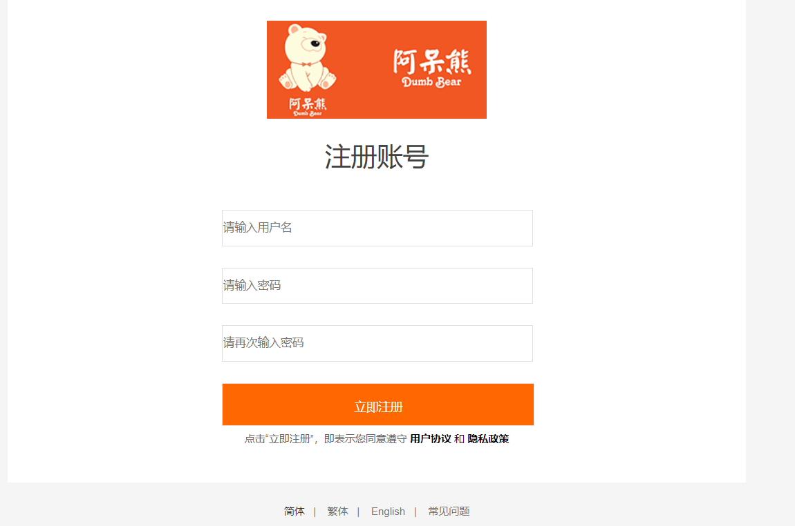
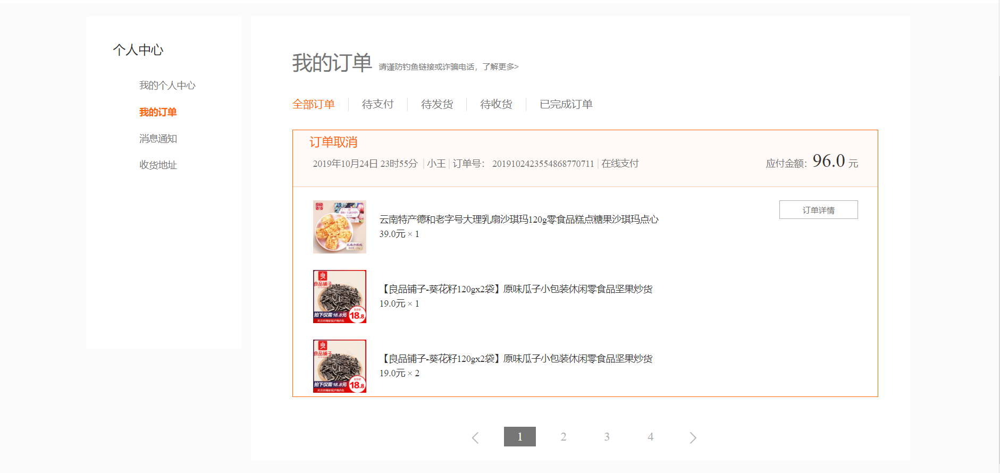
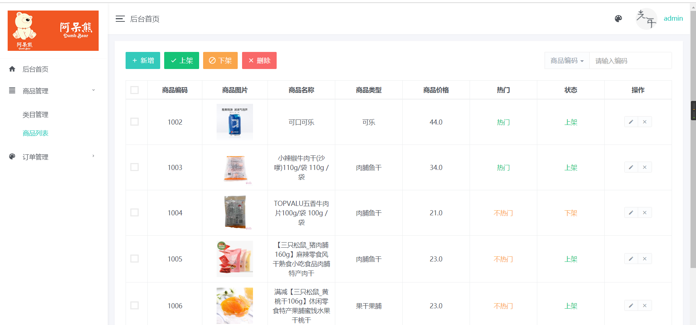

# lsxsglxt
* 介绍：一个零食销售系统，前后台
主要实现了：商品前端展示，商品的搜索，商品的购买以及订单的管理，地址的选择和用户的登录注册，
商品管理实现的是对商品的增加（选择图片的展示），修改（将商品的状态变成上架以及推荐），删除（删除不需要的商品），商品的详情，商品类别的管理（添加，删除，启用，禁用）等等；
有订单管理提供订单的下单，发货，收货，取消订单等等。

# 配置文件
* sql文件的resources的sql中
* 自动生成mapper和model的插件在resources中的generator文件夹中，用户名，密码需要自己更改。
* 连接数据库的文件是application.yml，用户名，密码需要自己更改。

# 项目截图
* 首页

* 用户登录

* 用户注册

* 前台订单

* 后台订单

* 商品管理界面图

